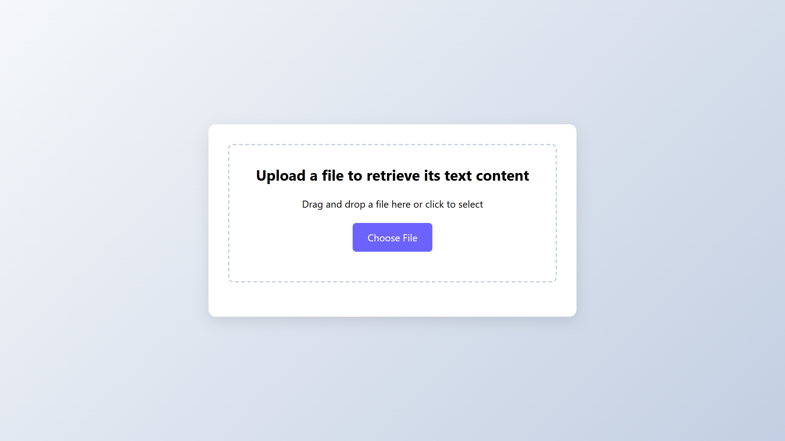

# [Parser](https://parser.excoffierleonard.com)

REST API service in Rust that takes in any file and returns its parsed content.

Demonstration URL: [https://parser.excoffierleonard.com](https://parser.excoffierleonard.com)

Demonstration Endpoint: [https://parser.excoffierleonard.com/parse](https://parser.excoffierleonard.com/parse)



## 📚 Table of Contents

- [Features](#-features)
- [Prerequisites](#-prerequisites)
- [Configuration](#-configuration)
- [Deployment](#-deployment)
- [API Documentation](#-api-documentation)
- [Development](#-development)
- [License](#-license)

## 📦 Features

Currently, the service supports the following file types:

- `pdf`
- `docx`

## 🛠 Prerequisites

- [Docker](https://docs.docker.com/get-docker/)
- [Docker Compose](https://docs.docker.com/compose/install/)

## ⚙ Configuration

The service can be configured using the following environment variables.

- `PARSER_APP_PORT`: The port on which the program listens on. (default: 8080)

## 🚀 Deployment

```bash
curl -o compose.yaml https://raw.githubusercontent.com/excoffierleonard/parser/refs/heads/main/compose.yaml && docker compose up -d
```

## 📖 API Documentation

API documentation and examples are available in [docs/api.md](docs/api.md).

## 🧪 Development

Useful commands for development:

- Full build:

```bash
chmod +x ./scripts/build.sh && \
./scripts/build.sh
```

## 📜 License

This project is licensed under the MIT License - see the [LICENSE](LICENSE) file for details.