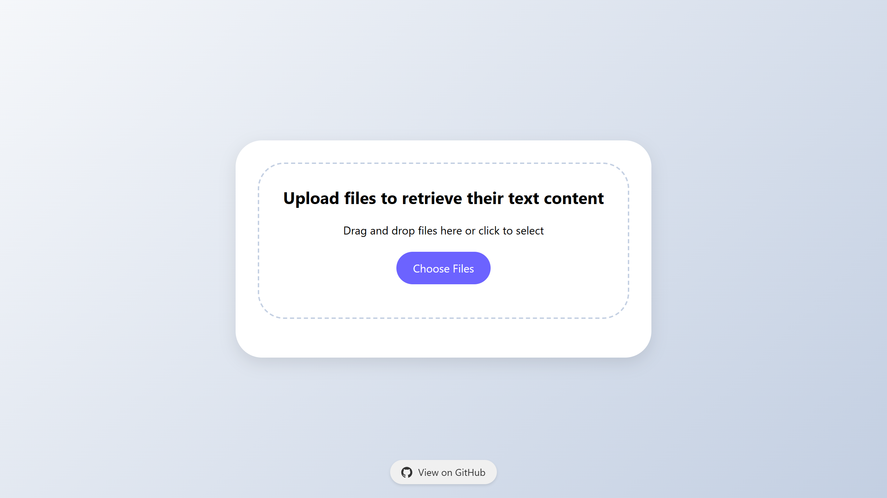

# [Parser](https://parser.excoffierleonard.com)

REST API service in Rust that takes in any file and returns its parsed content.

Demonstration URL: [https://parser.excoffierleonard.com](https://parser.excoffierleonard.com)

Demonstration Endpoint: [https://parser.excoffierleonard.com/parse](https://parser.excoffierleonard.com/parse)



## 📚 Table of Contents

- [Supported File Types](#-supported-file-types)
- [Prerequisites](#-prerequisites)
- [Configuration](#-configuration)
- [Deployment](#-deployment)
- [API Documentation](#-api-documentation)
- [Development](#-development)
- [License](#-license)

## 📦 Supported File Types

The API supports the following file formats:

- PDF (`.pdf`)
- Word Documents (`.docx`)
- Excel Spreadsheets (`.xlsx`)
- PowerPoint Presentations (`.pptx`)
- All text-based files including but not limited to:
  - Plain text (`.txt`)
  - Source code files (`.rs`, `.py`, `.js`, `etc.`)
  - Configuration files (`.json`, `.yaml`, `.toml`, `etc.`)
  - Markup files (`.html`, `.md`, `.xml`)
  - Data files (`.csv`, `.tsv`)
  - Log files (`.log`)
- All image-based files (OCR) including but not limited to:
  - Raster images (`.png`, `.jpg`, `.jpeg`, `.gif`, `.bmp`, `.webp`, `etc.`)
  - Icon files (`.ico`)
  - Animated images (`.gif`)

The OCR functionality supports English and French languages.

## 🛠 Prerequisites

For local build:

- Rust
- Tesseract

For deployment:

- [Docker](https://docs.docker.com/get-docker/)
- [Docker Compose](https://docs.docker.com/compose/install/)

## ⚙ Configuration

The service can be configured using the following environment variables.

- `PARSER_APP_PORT`: _INT_, The port on which the program listens on. (default: 8080)
- `ENABLE_FILE_SERVING`: _BOOL_, Enable serving files for the frontend. (default: false, just the API is enabled)

## 🚀 Deployment

```bash
curl -o compose.yaml https://raw.githubusercontent.com/excoffierleonard/parser/refs/heads/main/compose.yaml && \
docker compose up -d
```

## 📖 API Documentation

API documentation and examples are available in [docs/api.md](docs/api.md).

## 🧪 Development

Useful commands for development:

- Full build:

```bash
chmod +x ./scripts/build.sh && \
./scripts/build.sh
```

- Deployment tests:

```bash
chmod +x ./scripts/deploy-tests.sh && \
./scripts/deploy-tests.sh
```

## 📜 License

This project is licensed under the MIT License - see the [LICENSE](LICENSE) file for details.

